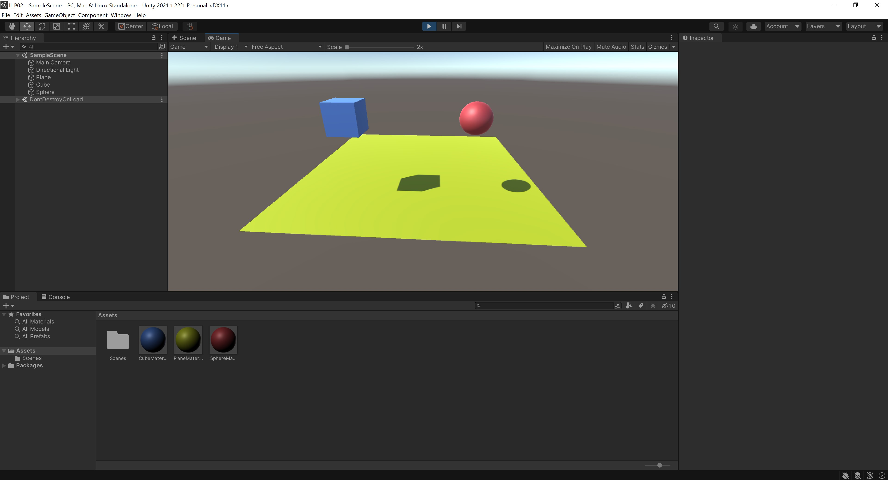
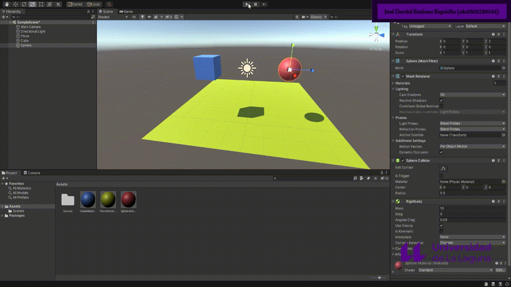
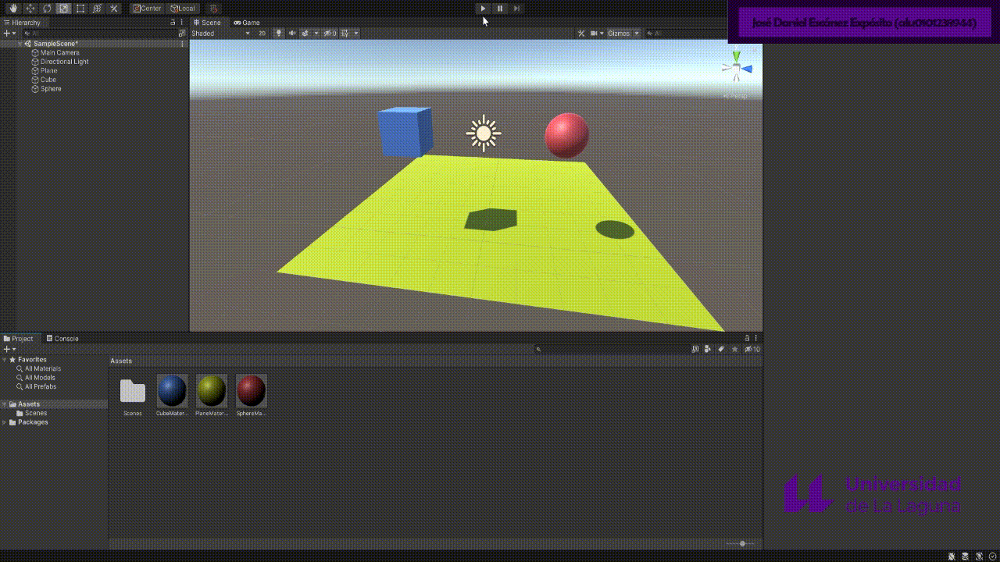
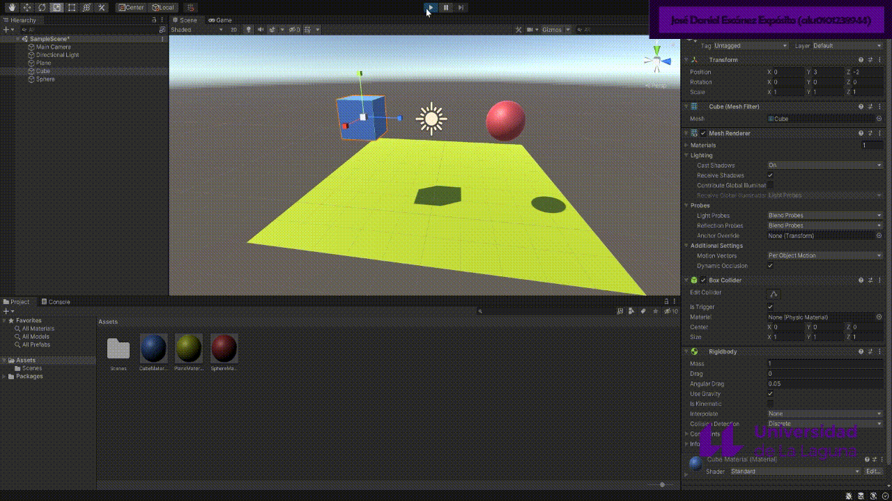
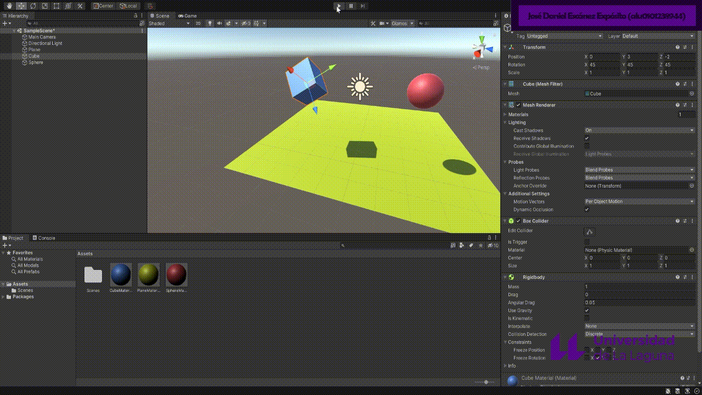

# Interfaces Inteligentes - P02 Introducción a los scripts en Unity
## José Daniel Escánez Expósito

---

### **Ejercicio 1**

Se ha creado una escena simple sobre la que se han probado diferentes configuraciones de objetos físicos en Unity. La escena contiene un plano a modo de suelo, una esfera y un cubo.

1. Ninguno de los dos objetos es físico

    * Los dos objetos quedan flotando en sus posiciones iniciales

    * 

2. La esfera tiene físicas, el cubo no

    * A la esfera se le aplica el component Rigidbody y esta cae por su peso (hasta impactar con el plano)
   
    * El cubo flota en su posición inicial

    * 

3. La esfera y el cubo tienen físicas

    * A la esfera y al cubo se le aplica el component Rigidbody y estos caen por su peso hasta impactar con el plano (a la vez)

    * 

4. La esfera y el cubo son físicos y la esfera tiene 10 veces la masa del cubo

    * A la esfera y al cubo se le aplica el component Rigidbody y estos caen por su peso hasta impactar con el plano (a la vez también). Aunque el peso no es el mismo para ambos objetos, la aceleración que experimentan si es la misma, dado que es independiente de la masa

    * 

5. La esfera tiene físicas y el cubo es de tipo IsTrigger

    * A la esfera se le aplica el component Rigidbody y esta cae por su peso (hasta impactar con el plano)
    
    * Al cubo se le activa el booleano de isTrigger del component Box Collider y queda flotando en su posición inicial

    * 

6. La esfera tiene físicas, el cubo es de tipo IsTrigger y tiene físicas

    * A la esfera se le aplica el component Rigidbody y esta cae por su peso hasta impactar con el plano
    
    * Al cubo se le activa el booleano de isTrigger del component Box Collider y se le aplica el component Rigidbody y esta cae por su peso indefinidamente, atravesando el plano

    * 

7. La esfera y el cubo son físicos y la esfera tiene 10 veces la masa del cubo, se impide la rotación del cubo sobre el plano XZ

    * A la esfera y al cubo se le aplica el component Rigidbody y estos caen por su peso hasta impactar con el plano (a la vez también). Aunque el peso no es el mismo para ambos objetos, la aceleración que experimentan si es la misma, dado que es independiente de la masa

    * El cubo tiene activados los booleanos de Freeze Rotation en los eje Y (perpendicular al plano XZ), por lo que al caer se puede obsevar ese comportamiento

    * 

---

### **Ejercicio 2**

Sobre la escena anterior se ubica un nuevo cubo que tendrá función de personaje. Se implementó el script [CharacterController.cs](CharacterController.cs), para realizar el desplazamiento por pantalla (mediante 'wasd') del jugador sin aplicar simulaciones físicas, permitiendo graduar su velocidad desde el inspector de Unity. También permite girar en el eje Y usando las teclas 'q' y 'e'.

```cs
// CharacterController.cs

using System.Collections;
using System.Collections.Generic;
using UnityEngine;

public class CharacterController : MonoBehaviour {
  public float speed = 10.0f;
  public float rotationSpeed = 100.0f;
  
  private Transform tf;
    
  void Awake() {
    tf = GetComponent<Transform>();
  }

  void Update() {
    float translationV = Input.GetAxis("Vertical1") * speed * Time.deltaTime;
    float translationH = Input.GetAxis("Horizontal1") * speed * Time.deltaTime;
    float rotation = Input.GetAxis("Up1") * rotationSpeed * Time.deltaTime;

    Vector3 translateVector = new Vector3(- translationV, 0, translationH);
    Vector3 rotateVector = rotation * Vector3.up;
    tf.Translate(translateVector);
    tf.Rotate(rotateVector);
  }
}

```


---

### **Ejercicio 3**

- Se puede obsevar, en el siguiente gif, la inclusión de varios cilindros en la escena. Al colindar con ellos, crecen de tamaño y el jugador aumenta su puntuación.

```cs
// CharacterController2.cs

using System.Collections;
using System.Collections.Generic;
using UnityEngine;

public class CharacterController2 : MonoBehaviour {
  public float speed = 10.0f;
  public float rotationSpeed = 100.0f;

  public static int score = 0;
  private Rigidbody rb;
  private Transform tf;

  void Awake() {
    rb = GetComponent<Rigidbody>();
    tf = GetComponent<Transform>();
  }

  void FixedUpdate() {
    Vector3 mInput = new Vector3(- Input.GetAxis("Vertical1"), 0f, Input.GetAxis("Horizontal1"));
    Vector3 rInput = Vector3.up * Input.GetAxis("Up1");
    Vector3 deltaPosition = transform.TransformDirection(mInput * Time.deltaTime * speed);
    Quaternion deltaRotation = Quaternion.Euler(rInput * Time.deltaTime * rotationSpeed);
    rb.MovePosition(rb.position + deltaPosition);
    rb.MoveRotation(rb.rotation * deltaRotation);
  }
}

// CylinderScript.cs

using System.Collections;
using System.Collections.Generic;
using UnityEngine;

public class CylinderScript : MonoBehaviour {
  private Transform tf;
  public float scale = 0.25f;

  void Awake() {
    tf = GetComponent<Transform>();
  }

  void OnCollisionEnter(Collision collision) {
    if (collision.gameObject.tag == "Player") {
      tf.localScale += Vector3.one * scale;
      Debug.Log(collision.gameObject.name + ": " + ++CharacterController2.score);
    }
  }
}

```

- Los cilindros morados, además, huyen del jugador al apretar la tecla 'espacio'.

```cs
// CylinderAScript.cs

using System.Collections;
using System.Collections.Generic;
using UnityEngine;

public class CylinderAScript : MonoBehaviour {
  private Transform tf;
  private Rigidbody rb;
  public float power = 1.0f;

  void Awake() {
    tf = GetComponent<Transform>();
    rb = GetComponent<Rigidbody>();
  }

  void FixedUpdate() {
    if (Input.GetKey("space")) {
      Vector3 distanceV = tf.position - GameObject.FindGameObjectWithTag("Player").GetComponent<Transform>().position;
      rb.AddForce(power * distanceV);
    }
  }
}

```

- Los cilindros rosas, sin embargo, huyen del jugador cuando se acerca.

```cs
// CylinderBScript.cs

using System.Collections;
using System.Collections.Generic;
using UnityEngine;

public class CylinderBScript : MonoBehaviour {
  private Transform tf;
  private Rigidbody rb;
  public float power = 2.0f;
  public float distanceLimit = 4.0f;

  void Awake() {
    tf = GetComponent<Transform>();
    rb = GetComponent<Rigidbody>();
  }

  void FixedUpdate() {
    Vector3 playerPos = GameObject.FindGameObjectWithTag("Player").GetComponent<Transform>().position;
    Vector3 distanceV = tf.position - playerPos;
    if (Vector3.Distance(tf.position, playerPos) <= distanceLimit) {
      rb.AddForce(power * distanceV);
    }
  }
}

```

- Existe una esfera negra en la escena capaz de detectar colisiones y que se mueve gracias a las teclas 'I', 'J', 'L', 'M'.

```cs
// CharacterController3.cs

using System.Collections;
using System.Collections.Generic;
using UnityEngine;

public class CharacterController3 : MonoBehaviour {
  public float speed = 10.0f;

  private Rigidbody rb;
  private Transform tf;

  void Awake() {
    rb = GetComponent<Rigidbody>();
    tf = GetComponent<Transform>();
  }

  void OnCollisionEnter(Collision collision) {
    Debug.Log("Colisión detectada con: " + collision.gameObject.name);
  }

  void FixedUpdate() {
    Vector3 mInput = new Vector3(- Input.GetAxis("Vertical2"), 0f, Input.GetAxis("Horizontal2"));
    Vector3 deltaPosition = transform.TransformDirection(mInput * Time.deltaTime * speed);
    rb.MovePosition(rb.position + deltaPosition);
  }
}

```

- Además, los cuadrados azules y rojos crecen cuando se acerca la esfera y disminuyen cuando lo hace el jugador.

```cs
// BigSmallCube.cs

using System.Collections;
using System.Collections.Generic;
using UnityEngine;

public class BigSmallCube : MonoBehaviour {
  public float power = 5.0f;

  private SphereCollider sphereCollider;
  private Vector3 originalSize;
  private float radius;

  void Awake() {
    sphereCollider = GetComponent<SphereCollider>();
    originalSize = transform.localScale;
    radius = sphereCollider.radius * originalSize.x;
  }

  void OnTriggerStay(Collider anotherCollide) {
    string tag = anotherCollide.gameObject.tag;
    if (tag == "Sphere" || tag == "Player") {
      Vector3 anotherPos = anotherCollide.gameObject.transform.position;
      float distance = Vector3.Distance(anotherPos, transform.position);
      if (distance < radius) {
        float scaleAmount = (tag == "Player" ? -1 : 1) * (1 - distance / radius) * power;
        transform.localScale = originalSize + scaleAmount * Vector3.one;
      }
    }
  }
}

```

